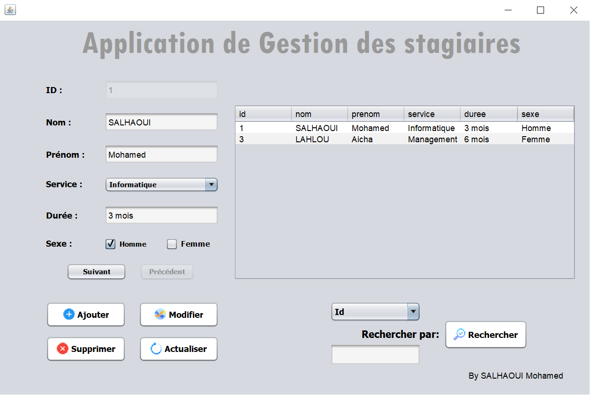

# Gestion-des-stagiaires
A Java Based Desktop Application for Registring &amp; managing internships built in Summer Internship training at OCPK.

<!-- LOGO -->
 

  

<!-- TABLE OF CONTENTS -->
## Table of Contents

* [About the Project](#about-the-project)
* [Built With](#built-with)
* [Contact](#contact)

<!-- ABOUT THE PROJECT -->
## About The Project
A Java Based Desktop Application for Registring & managing internships built in Summer Internship training at OCPK (Office chérifien des phosphates à Khouribga - Morocco).

    
  </a>

## Built With
Java
 
MySQL
 
NetBeans

<!-- CONTACT -->
## Contact

SALHAOUI Mohamed - med.salhaoui97@gmail.com

Project Link: [https://github.com/med-S/Gestion-des-stagiaires/](https://github.com/med-S/Gestion-des-stagiaires/)

